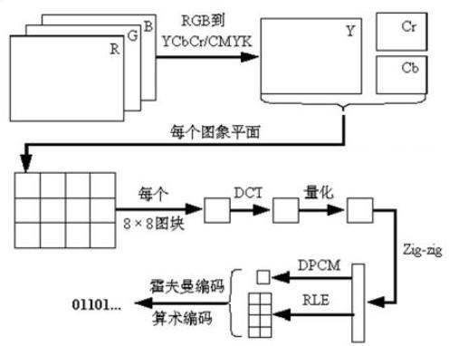

# 视频基础

## 图像

### 像素与PPI

像素（Pixel，缩写PX）是图像显示的基本单位。

我们通常说一幅图片的大小，例如是 1920×1080，就是宽度为 1920 个像素点，高度为1080 个像素点。乘积是 2,073,600，也就是说，这个图片是两百万像素的。1920×1080，也被称为这幅图片的分辨率。

PPI，就是“Pixels Per Inch”，每英寸像素数。即手机（或显示器）屏幕上每英寸面积，到底能放下多少个“像素点”。这个值当然是越高越好，PPI 越高，图像就越清晰细腻。


以前的功能机，例如诺基亚，屏幕 PPI 都很低，有很强烈的颗粒感。

### RGB 颜色

任何颜色，都可以通过红色（Red）、绿色（Green）、蓝色（Blue）按照一定比例调制出来。这三种颜色，被称为“三原色”

在计算机里，R、G、B 也被称为“基色分量”。它们的取值，分别从 0 到 255，一共 256 个等级（256 是 2 的 8 次方）。所以，任何颜色，都可以用 R、G、B 三个值的组合表示。

通过这种方式，一共可以表达256×256×256=16,777,216 种颜色，因此也简称为 1600 万色。
RGB 三色，每色有 8bit，这种方式表达出来的颜色，也被称为 24 位色（占用 24bit）。
这个颜色范围已经超过了人眼可见的全部色彩，所以又叫真彩色。再高的话，对于我们人眼来说，已经没有意义了，完全识别不出来。

采样的位深有：8,16,32。

衡量视频，最主要的一个指标参数，就是帧率（Frame Rate）。在视频中，一个帧（Frame）就是指一幅静止的画面。帧率，就是指视频每秒钟包括的画面数量（FPS，Frames per second）。帧率越高，视频就越逼真、越流畅。

### YUV 信号

简单来说，YUV 就是另外一种颜色数字化表示方式。**视频通信系统之所以要采用 YUV，而不是 RGB，主要是因为 RGB 信号不利于压缩**。在 YUV 这种方式里面，加入了亮度这一概念。在最近几十年中，视频工程师发现，眼睛对于亮和暗的分辨要比对颜色的分辨更精细一些，也就是说，人眼对色度的敏感程度要低于对亮度的敏感程度。所以，工程师认为，在我们的视频存储中，没有必要存储全部颜色信号。我们可以把更多带宽留给黑—白信号（被称作“亮度”），将稍少的带宽留给彩色信号（被称作“色度”）。于是，就有了 YUV。

YUV 里面的“Y”，就是亮度（Luma），“U”和“V”则是色度（Chroma）。偶尔会见到的 Y'CbCr，也称为 YUV，是 YUV 的压缩版本，不同之处在于 Y'CbCr用于数字图像领域，YUV 用于模拟信号领域，MPEG、DVD、摄像机中常说的 YUV 其实就是 Y'CbCr。

- Y：亮度，就是灰度值。除了表示亮度信号外，还含有较多的绿色通道量。
- U：蓝色通道与亮度的差值。
- V：红色通道与亮度的差值。


黑点表示采样该像素点的Y分量，以空心圆圈表示采用该像素点的UV分量

- YUV 4:4:4采样，每一个Y对应一组UV分量。
- YUV 4:2:2采样，每两个Y共用一组UV分量。 
- YUV 4:2:0采样，每四个Y共用一组UV分量

参考[图文详解YUV420数据格式](https://www.cnblogs.com/azraelly/archive/2013/01/01/2841269.html)

**通常用的是 YUV4:2:0 的采样方式,能获得 1/2 的压缩率。这些预处理做完之后,就是正式的编码了**。

### HSV 人类视觉系统

HSV对应色调，饱和度，明度。

- 对高频信息不敏感
-  对高对比度更敏感
-  对亮度信息比色度信息更敏感
-  对运动的信息更敏感

针对 HSV 的特点，数字视频系统的设计应该考虑哪些因素？

- 丢弃高频信息，只编码低频信息
- 提高边缘信息的主观质量
-  降低色度的解析度
-  对感兴趣区域（Region of Interesting，ROI）进行特殊处理

YUV 色彩空间是指，Y：亮度分量，UV：两个色度分量。YUV 能更好的反映 HVS 特点，主流的编解码标准的压缩对象都是 YUV 图像。

### RGB 空间转化到 YUV 空间

```c
Y = 0.299 R + 0.587 G + 0.114 B
  约 0.3R + 0.6G + 0.1B 
```

### 未经编码的视频数据量有多大？

有了视频之后，就涉及到两个问题：

- 一个是存储
- 二个是传输

以一个分辨率 1920×1080，帧率 30 的视频为例：

共：1920×1280=2,073,600（Pixels 像素），每个像素点是 24bit（前面算过），也就是每幅图片 2073600×24=49766400 bit，8 bit（位）= 1 byte（字节），所以：49766400bit = 6220800byte≈6.22MB。

这是一幅 1920×1080 图片的原始大小，再乘以帧率 30，也就是说，每秒视频的大小是 186.6MB，每分钟大约是 11GB，一部 90 分钟的电影，约是1000GB。

如果按照 100Mbps 的网速（12.5MB/s），下载那部电影，需要 22 个小时。于是，必须要对视频进行编码。

**编码的终极目的，说白了，就是为了压缩。**

各种五花八门的视频编码方式，都是为了让视频变得体积更小，有利于存储和传输。

视频从录制到播放的整个过程，如下：


### 帧

- I 帧：帧内编码帧，大多数情况下 I 帧就是关键帧，就是一个完整帧，无需任何辅助
  就能独立完整显示的画面。
- B 帧：帧是双向预测帧。参考前后图像帧编码生成。需要前面的 I/P 帧或者后面的
  P 帧来协助形成一个画面。
- P 帧：前向预测编码帧。是一个非完整帧，通过参考前面的 I 帧或 P 帧生成画面。

场是电视的概念，当计算机在显示器上播放视频时，它只会显示一系列完整的帧，而不使用交错场的电视技巧。不需要对场有太多的了解。


### 比特率/码率

比特率即码率，在不同领域有不同的含义，在多媒体领域，指单位时间播放音频或视频的比特数，可以理解成吞吐量或带宽。单位为 bps , 即 bits per second，每秒传输的数据量，常用单位有：kbps、mbps 等。

计算公式：码率（kbps）= 文件大小（kb）/ 时长（s）

通俗一点理解就是取样率，取样率越大，精度就越高，图像质量越好，但数据量也越大，所以要找到一个平衡点：用最低的比特率达到最少的失真。

在一个视频中，不同时段画面的复杂程度是不同的，比如高速变化的场景和几乎静止的场景，所需的数据量也是不同的，若都使用同一种比特率是不太合理的，所以引入了动态比特率。

动态比特率简称为 VBR，即 Variable Bit Rate，比特率可以随着图像复杂程度的不同而随之变化。

图像内容简单的片段采用较小的码率，图像内容复杂的片段采用较大的码率，这样既保证了播放质量，又兼顾了数据量的限制。比如 RMVB 视频文件，其中的 VB 就是指 VBR，表示采用动态比特率编码方式，达到播放质量与体积兼得的效果。

静态比特率简称为 CBR，即 Constant Bit Rate，比特率恒定。图像内容复杂的片段质量不稳定，图像内容简单的片段质量较好。上面列出的计算公式显然是针对 CBR ，除 VBR 和 CBR 外，还有 CVBR（Constrained VariableBit Rate） 、ABR (Average Bit Rate) 等等。

## 视频

数字视频可以理解为自然场景空间和时间的数字采样表示。

空间采样的主要技术指标为：分辨率(Resolution)


时间采样的主要技术指标为：帧率


### 视频文件格式

Windows 系统中的文件名都有后缀，例如 1.doc，2.wps，3.psd 等等。Windows 设置后缀名的目的是让系统中的应用程序来识别并关联这些文件，让相应的文件由相应的应用程序打开。所以常见的如 1.avi，2.mpg 这些都叫做视频的文件格式，它由你电脑上安装的视频播放器关联。

### 视频封装格式

AVI，MPEG，VOB 等是一种视频封装格式，相当于一种储存视频信息的容器。

**封装：就是封装格式，简单来说，就是将已经编码压缩好的视频轨和音频轨按照一定的格式放到一个文件中。**

封装格式也称多媒体容器Container，它只是为多媒体编码提供了一个“外壳”，也就是将所有的处理好的视频、音频或字幕都包装到一个文件容器内呈现给观众，这个包装的过程就叫封装。


- AVI 格式（后缀为.AVI）：它的英文全称为 Audio Video Interleaved，即音频视频交错格式。它于 1992 年被 Microsoft 公司推出。 这种视频格式的优点是图像质量好。由于无损 AVI 可以保存 alpha 通道，经常被我们使用。缺点太多，体积过于庞大，而
  且更加糟糕的是压缩标准不统一。
- DV-AVI 格式（后缀为.AVI）：DV 的英文全称是 Digital Video Format，是由索尼、松下、JVC 等多家厂商联合提出的一种家用数字视频格式。
- MPEG 格式（文件后缀可以是 .MPG .MPEG .MPE .DAT .VOB .ASF .3GP .MP4等）：它的英文全称为 Moving Picture Experts Group，即运动图像专家组格式，该专家组建于 1988 年，专门负责为 CD 建立视频和音频标准，而成员都是为视频、音频及系统领域的技术专家。MPEG 文件格式是运动图像压缩算法的国际标准。MPEG 格式目前有三个压缩标准，分别是 MPEG－1、MPEG－2、和 MPEG－4。MPEG－1、MPEG－2 目前已经使用较少，着重介绍 MPEG－4，其制定于 1998 年，MPEG－4 是为了播放流式媒体的高质量视频而专门设计的，以求使用最少的数据获得最佳的图像质量。目前 MPEG-4 最有吸引力的地方在于它能够保存接近于 DVD 画质的小体积视频文件。
- Flash Video 格式（后缀为.FLV）：由 Adobe Flash 延伸出来的的一种流行网络视频封装格式。随着视频网站的丰富，这个格式已经非常普及。

#### MP4格式分析


### 视频编码格式

所谓视频编码方式就是指能够对数字视频进行压缩或者解压缩（视频解码）的程序或者设备。通常这种压缩属于有损数据压缩。

也可以指通过特定的压缩技术，将某个视频格式转换成另一种视频格式。常见的编码方式有：

#### H.26X 系列 

它由 ITU[国际电传视讯联盟]主导，包括 H.261、H.262、H.263、H.264、H.265。

- H.261：主要在老的视频会议和视频电话产品中使用。
- H.263：主要用在视频会议、视频电话和网络视频上。
- **H.264**：H.264/MPEG-4 第十部分，或称 AVC（Advanced Video Coding，高级视频编码），是一种视频压缩标准，一种被广泛使用的高精度视频的录制、压缩和发布格式。
- **H.265**：高效率视频编码（High Efficiency Video Coding，简称 HEVC）是一种视频压缩标准，H.264/MPEG-4 AVC 的继任者。HEVC 被认为不仅提升图像质量，同时也能达到H.264/MPEG-4 AVC两倍之压缩率（等同于同样画面质量下比特率减少了50%），可支持 4K 分辨率甚至到超高画质电视，最高分辨率可达到 8192×4320（8K 分辨率），这是目前发展的趋势。直至 2013 年，Potplayer 添加了对于 H.265 视频的解码，尚未有大众化编码软件出现。

#### MPEG 系列

由 ISO国际标准组织机构下属的 MPEG运动图象专家组]开发。视频编码方面主要有：

- MPEG-1 第二部分（MPEG-1 第二部分主要使用在 VCD 上，有些在线视频也使用这种格式。该编解码器的质量大致上和原有的 VHS 录像带相当。
- MPEG-2 第二部分（MPEG-2 第二部分等同于 H.262，使用在 DVD、SVCD 和大多数数字视频广播系统和有线分布系统（cable distribution systems）中。）
- MPEG-4 第二部分（MPEG-4 第二部分标准可以使用在网络传输、广播和媒体存储上。比起 MPEG-2 和第一版的 H.263，它的压缩性能有所提高。）
- MPEG-4 第十部分（MPEG-4 第十部分技术上和 ITU-TH.264 是相同的标准，有时候也被叫做“AVC”）最后这两个编码组织合作，诞生了 H.264/AVC 标准。ITU-T 给这个标准命名为 H.264，而 ISO/IEC 称它为 MPEG-4 高级视频编码（Advanced Video
  Coding，AVC）。

视频的编码格式才是一个视频文件的本质所在，不要简单的通过文件格式和封装形式来区分视频。

**视频文件的封装格式并不影响视频的画质，影响视频画面质量的是视频的编码格式。**


# 视频编码

原始视频压缩的目的是去除冗余信息，可以去除的冗余包括：

- 空间冗余：图像相邻像素之间有较强的相关性
- 时间冗余：视频序列的相邻图像之间内容相似
- 编码冗余：不同像素值出现的概率不同
- 视觉冗余：人的视觉系统对某些细节不敏感
- 知识冗余：规律性的结构可由先验知识和背景知识得到

## 无损压缩

压缩前、解压缩后图像完全一致 X=X'，压缩比低(2:1~3:1)。典型格式例如：Winzip，JPEG-LS。

## 有损压缩

压缩前解压缩后图像不一致 X≠X'，压缩比高(10:1~20:1)，利用人的视觉系统的特性。典型格式例如：MPEG-2，H.264/AVC，AVS。

## 编码定义

定义：通过特定的压缩技术，将某个视频格式的文件转换成另一种视频格式。

视频数据在时域和空域层面都有极强的相关性，这也表示有大量的时域冗余信息和空域冗余信息，压缩技术就是去掉数据中的冗余信息。

### 去除时域冗余信息

- 运动补偿：通过先前的局部图像来预测、补偿当前的局部图像，可有效减少帧序列冗余信息。
- 运动表示：不同区域的图像使用不同的运动矢量来描述运动信息，运动矢量通过熵编码进行压缩（熵编码在编码过程中不会丢失信息）。
- 运动估计：从视频序列中抽取运动信息。 通用的压缩标准使用基于块的运动估计和运动补偿。

### 去除空域冗余信息

- 变换编码：将空域信号变换到另一正交矢量空间，使相关性下降，数据冗余度减小。
- 量化编码：对变换编码产生的变换系数进行量化，控制编码器的输出位率。
- 熵编码：对变换、量化后得到的系数和运动信息，进行进一步的无损压缩。


视频编码技术优先消除的目标，就是空间冗余和时间冗余。

## H.264编码介绍

### IPB 帧

I 帧：帧内编码帧(intra picture)，采用帧内压缩去掉空间冗余信息。是自带全部信息的独立帧，是最完整的画面（占用的空间最大），无需参考其它图像便可独立进行解码。视频序列中的第一个帧，始终都是 I 帧。

P 帧：前向预测编码帧(predictive-frame)，通过将图像序列中前面已经编码帧的时间冗余信息来压缩传输数据量的编码图像。参考前面的 I 帧或者 P 帧。P 帧对前面的 P 和 I 参考帧有依赖性。但是，P 帧压缩率比较高，占用的空间较小。

B 帧：双向预测内插编码帧(bi-directional interpolated prediction frame)，既考虑源图像序列前面的已编码帧，又顾及源图像序列后面的已编码帧之间的冗余信息，来压缩传输数据量的编码图像，也称为双向编码帧。参考前面一个的 I 帧或者 P 帧及其后面的一个 P 帧。所以，它的压缩率最高，可以达到 200:1。**不过，因为依赖后面的帧，所以不适合实时传输（例如视频会议）**。

对帧的分类处理可以大大压缩视频的大小。毕竟，要处理的对象,大幅减少了(从整个图像,变成图像中的一个区域)。


### PTS 和 DTS

- DTS(Decoding Time Stamp)是标识读入内存中 bit 流在什么时候开始送入解码器中进行解码。也就是解码顺序的时间戳。
- PTS(Presentation Time Stamp)用于度量解码后的视频帧什么时候被显示出来。在没有B 帧的情况下，DTS 和 PTS 的输出顺序是一样的，一旦存在 B 帧，PTS 和 DTS 则会不同。也就是显示顺序的时间戳。

### GOP

即 Group of picture(图像组)，指两个 I 帧之间的距离，Reference(参考周期)指两个 P 帧之间的距离。

一个 I 帧所占用的字节数大于一个 P 帧，一个 P 帧所占用的字节数大于一个 B 帧。所以在码率不变的前提下，GOP 值越大，P、B 帧的数量会越多，平均每个 I、P、B 帧所占用的字节数就越多，也就更容易获取较好的图像质量；Reference 越大，B 帧的数量越多，同理也更容易获得较好的图像质量。

简而言之：

字节大小：I > P > B

解码顺序：I -> P -> B


### 运动估计和补偿


人在动，但背景没动。左边是I帧，右边是P帧。差值为：


也就是说,图中的部分像素,进行了移动。移动轨迹如下：


这就是运动估计和补偿：


### 块(Block)与宏块(MacroBlock)

如果总是按照像素来算,数据量会比较大,所以,一般都是把图像切割为不同的“块(Block)”或“宏块(MacroBlock)”,对它们进行计算。

一个宏块一般为 16 像素×16 像素。

## 帧内编码



大致过程如下：

- RGB 转 YUV:固定公式
- 图片宏块切割:宏块 16x16
- DCT:离散余弦变换
- 量化:取样
- ZigZag 扫描:
- DPCM:差值脉冲编码调制
- RLE:游程编码
- 霍夫曼编码:
- 算数编码:

# 视频解码

## 软解与硬解性能对比

软解码性能比硬解码差，指的是普通嵌入式系统，cpu主频才一个G，而现在的cpu是8核2G，所有它的解码性能是强于硬解码。且兼容性更强。

硬解码是写死的，比如只能是60帧/s。它的好处是它是固化的程序，不需要做指令转换，开销少，热供电小，不耗电。

如果没有特殊的要求，比如对解码速率要求很高，比如200帧/s，就只能用软解码。而对于正常视频播放，硬解码也无妨。


# 音频

音频数据的承载方式最常用的是脉冲编码调制，即 PCM。

在自然界中，声音是连续不断的，是一种模拟信号。声音是一种波，有自己的振幅和频率，要保存声音，就要保存声音在各个
时间点上的振幅。

PCM 的采集步骤分为以下步骤: 模拟信号 -> 采样 -> 量化 -> 编码 -> 数字信号。

奈奎斯特采样定理 : 为了不失真地恢复模拟信号,采样频率应该不小于模拟信号频谱中最高频率的 2 倍。

音调--->频率

音量--->振幅

音色--->不规则的正弦波（主音与泛音（环境声音）的叠加），即波形。

## 采样率

即采样的频率。

采样率要大于原声波频率的 2 倍，人耳能听到的最高频率为 20kHz，为了满足人耳的听觉要求，采样率至少为 40kHz，通常为 44.1kHz，更高的通常为 48kHz。

人耳听觉频率范围 [20Hz, 20KHz]

### 采样位数

采样位数也叫采样大小或者量化位数。

波形振幅在模拟信号上是连续的样本值，在数字信号中，要对其进行量化，只能取一个近似的值。为了记录这些振幅，采样器会采用一个固定的位数。通常有8位、16位、32位。位数越多,量化后的波形越接近原始波形，声音的质量越高,而需要的存储空间也越多。


## PCM音频参数

- 采样率sample_rate = 44100 (CD音质)


样本大小

- AV_SAMPLE_FMT_S16：16位存储采样
- AV_SAMPLE_FMT_FLTP：一个float是32位，用浮点来存采样。用浮点来运算，效率更高

样本类型planar

- AV_SAMPLE_FMT_S16：在内存的格式是c1,c2,c1,c2,c1,c2。双声道交错
- AV_SAMPLE_FMT_S16P：在内存的格式是c1,c1,c1,...,c2,c2,c2...。先第一通道，后第二通道


## 通道数

**单声道**：单声道的声音只能使用一个扬声器发声，也可以让两个扬声器输出同一个声道的声音。当两个扬声器回放单声道信息的时候，我们可以明显感觉到声音是从两个音箱中间传递到我们耳朵里的，无法判断声源的具体位置。

**双声道**：双声道就是有两个声音通道，其原理是人们听到声音时可以根据左耳和右耳对声音相位差来判断声源的具体位置。声音在录制过程中被分配到两个独立的声道，从而达到了很好的声音定位效果。

记录声音时，如果每次生成一个声波数据，称为单声道；每次生成两个声波数据，称为双声道(立体声)。立体声(双声道)存储大小是单声道文件的两倍。

## 音频帧

音频跟视频不太一样，视频的每一帧就是一副图像，但是因为音频是流式的，本身是没有一帧的概念的。而且有些时候确实没有办法说一帧怎么怎么样。比如对于 PCM 流来说，采样率为 44100Hz，采样位数为 16，通道数为 2，那么一秒的音频固定大小的。44100 × 16 × 2 / 8 字节。但是人们可以规定一帧的概念，比如 amr 帧比较简单，它规定每 20ms 的音频是一帧。

## 音频码率

是指一个数据流中每秒钟能通过的信息量,单位 bps(bit per second)。

码率 = 采样率 * 采样位数 * 声道数

# 视频播放原理

## 视频播放通常步骤

视频播放器播放一个互联网上的视频文件（本地文件），需要经过以下几个步骤：

- 解协议
- 解封装
- 解码视音频
- 视音频同步

注意：“文件”本身也是一种“协议”。

### 解协议

将流媒体协议的数据，解析为标准的相应的封装格式数据。视音频在网络上传播的时候，常常采用各种流媒体协议，例如 HTTP，RTMP，或是 MMS 等等。

这些协议在传输视音频数据的同时，也会传输一些信令数据。这些信令数据包括对播放的控制（播放，暂停，停止），或者对网络状态的描述等。

**解协议的过程中会去除掉信令数据而只保留视音频数据**。例如，采用 RTMP 协议传输的数据，经过解协议操作后，输出 FLV 格式的数据。

### 解封装

**将输入的封装格式的数据，分离成为音频流压缩编码数据和视频流压缩编码数据**。封装格式种类很多，例如 MP4，MKV，RMVB，TS，FLV，AVI 等等，它的作用就是将已经压缩编码的视频数据和音频数据按照一定的格式放到一起。

例如，FLV 格式的数据，经过解封装操作后，输出 H.264 编码的视频码流和 AAC 编码的音频码流。

### 解码

**将视频/音频压缩编码数据，解码成为非压缩的视频/音频原始数据**。

音频的压缩编码标准包含 AAC，MP3，AC-3 等等，视频的压缩编码标准则包含 H.264，MPEG2，VC-1 等等。

解码是整个系统中最重要也是最复杂的一个环节。通过解码，压缩编码的视频数据输出成为非压缩的颜色数据，例如 YUV420P，RGB 等等；压缩编码的音频数据输出成为非压缩的音频抽样数据，例如 PCM 数据。

### 视音频同步

根据解封装模块处理过程中获取到的参数信息，同步解码出来的视频和音频数据，并将视频音频数据送至系统的显卡和声卡播放出来。